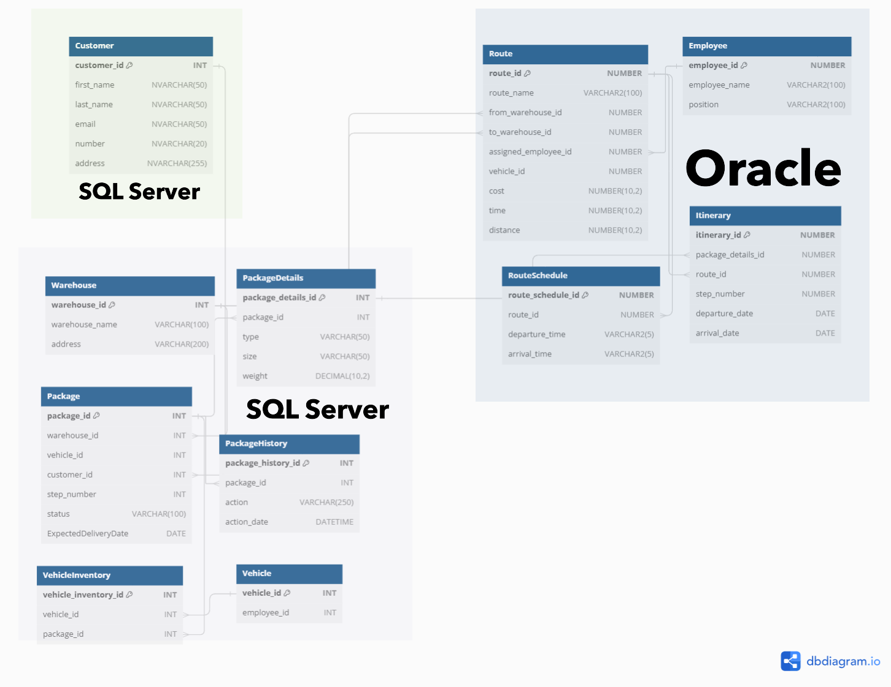

# Distributed Databases Project: Courier Company Database Documentation

## Introduction

### Project Objectives
The goal of our project was to create a database that enables the management of courier company operations. The database is designed to efficiently track and manage customer information, monitor packages from their receipt at the warehouse to final delivery to the customer, and record the history of each package, including status and location. The project also aims to manage deliveries effectively, including vehicle allocation, route optimization, and employee schedules to ensure timely deliveries. An important aspect is also the integration of data between SQL Server and Oracle systems to ensure consistency and data availability.

### Functionality
The database enables:
- Storing and managing customer information.
- Tracking the route of packages from the warehouse to the customer.
- Recording package history.
- Managing deliveries and vehicle allocation.
- Organizing routes and schedules for employees.
- Data integration between SQL Server and Oracle.

### Assumptions
- A vehicle can carry an unlimited number of packages.
- A warehouse can store an unlimited number of packages.
- Each package passes through at least one warehouse.
- A package cannot be transported from one warehouse to another without using a vehicle.

### Diagram

## Databases on SQL Server

### DC_Customer

#### Procedures
We wrote procedures to facilitate displaying customer information and adding new customers to the database.

#### PRINT_CUSTOMER_INFORMATION
The `PRINT_CUSTOMER_INFORMATION` procedure displays detailed information about the customer and related packages. It performs the following steps:
1. **Declare variables**: Declares variables needed to store customer and package information.
2. **Check if customer exists**: Checks if the customer with the given `@customer_id` exists in the `Customer` table. If not, raises an error and exits the procedure.
3. **Retrieve customer information**: Retrieves customer data from the `Customer` table and assigns it to declared variables.
4. **Display customer information**: Displays information such as ID, first name, last name, email, phone number, and address.
5. **Retrieve package information**: Creates a dynamic SQL query to fetch packages related to the customer from the `Package` table in the `DC_Warehouse` database.
6. **Display package information**: Uses a cursor to iterate through each package and displays details such as package ID, warehouse ID, status, and expected delivery date.

#### ADD_CUSTOMER
The `ADD_CUSTOMER` procedure adds a new customer to the database. It performs the following step:
1. **Insert new customer**: Inserts a new record into the `Customer` table with the provided `@first_name`, `@last_name`, `@address`, `@email`, and `@phone_number` values.

### DC_Warehouse

#### Procedures
We created procedures to facilitate the management of warehouses, vehicles, packages, and their history.

#### ADD_WAREHOUSE
The `ADD_WAREHOUSE` procedure adds a new warehouse to the database. It performs the following step:
1. **Insert new warehouse**: Inserts a new record into the `Warehouse` table with the provided `@warehouse_name` and `@address` values.

#### ADD_VEHICLE
The `ADD_VEHICLE` procedure adds a new vehicle to the database. It performs the following step:
1. **Insert new vehicle**: Inserts a new record into the `Vehicle` table with the provided `@employee_id` value.

#### ADD_PACKAGE
The `ADD_PACKAGE` procedure adds a new package to the database. It performs the following steps:
1. **Check if customer and warehouse exist**: Checks if the customer and warehouse with the given IDs exist in the database. If not, raises an error.
2. **Retrieve warehouse name**: Retrieves the warehouse name from the `Warehouse` table.
3. **Insert new package**: Inserts a new record into the `Package` table with the provided values and calculates the expected delivery date.
4. **Insert package details**: Inserts a record into the `PackageDetails` table with package information.
5. **Insert package history**: Inserts a record into the `PackageHistory` table with information about moving the package to the warehouse.
6. **Create best itinerary**: Calls the `ORACLE_CREATE_BEST_ITINERARY` procedure in the `DC_Customer` database.

#### PRINT_PACKAGE_HISTORY
The `PRINT_PACKAGE_HISTORY` procedure displays the history of a package. It performs the following steps:
1. **Check if package exists**: Checks if the package with the given ID exists in the database. If not, raises an error.
2. **Retrieve package history**: Retrieves records from the `PackageHistory` table for the given package.
3. **Display package history**: Uses a cursor to iterate through each action and displays details of the action and date.

#### MOVE_PACKAGE_TO_WAREHOUSE
The `MOVE_PACKAGE_TO_WAREHOUSE` procedure moves a package to another warehouse. It performs the following steps:
1. **Check if package exists**: Checks if the package with the given ID exists in the database. If not, raises an error.
2. **Retrieve package and route details**: Retrieves package details from the `PackageDetails` table and the current route from the Oracle database.
3. **Check if destination warehouse exists**: Checks if the destination warehouse exists in the database. If not, raises an error.
4. **Retrieve destination warehouse name**: Retrieves the name of the destination warehouse from the `Warehouse` table.
5. **Update package status**: Removes the package from the vehicle inventory, updates its status to "In Warehouse," updates the warehouse ID, and step number.
6. **Insert package history**: Inserts a record into the `PackageHistory` table with information about moving the package to the warehouse.

## Database on Oracle Server

### Routes

#### Procedures and Packages

#### EMPLOYEE_PACKAGE
The `EMPLOYEE_PACKAGE` contains the `INSERT_EMPLOYEE` procedure, which inserts new employee records into the `EMPLOYEE` table.

#### ITINERARY_PACKAGE
The `ITINERARY_PACKAGE` contains the `INSERT_ITINERARY` procedure, which inserts the travel itinerary for a package into the `ITINERARY` table.

#### ROUTES_PACKAGE
The `ROUTES_PACKAGE` contains the `INSERT_ROUTE` and `INSERT_ROUTE_SCHEDULE` procedures, which are responsible for inserting new routes between warehouses into the `Route` and `RouteSchedule` tables.

#### Triggers

##### Employee Table Trigger (trg_employee_id)
This trigger activates before inserting a new record into the `Employee` table. It automatically sets the `employee_id` value to the next value from the `seq_employee_id` sequence, ensuring unique identifiers for each new record.

##### Route Table Trigger (trg_route_id)
This trigger activates before inserting a new record into the `Route` table. It automatically sets the `route_id` value to the next value from the `seq_route_id` sequence, ensuring unique identifiers for each new record.

##### RouteSchedule Table Trigger (trg_route_schedule_id)
This trigger activates before inserting a new record into the `RouteSchedule` table. It automatically sets the `route_schedule_id` value to the next value from the `seq_route_schedule_id` sequence, ensuring unique identifiers for each new record.

##### Itinerary Table Trigger (trg_itinerary_id)
This trigger activates before inserting a new record into the `Itinerary` table. It automatically sets the `itinerary_id` value to the next value from the `seq_itinerary_id` sequence, ensuring unique identifiers for each new record.

## SQL Server Procedures Communicating with Oracle

### Procedures

#### ORACLE_INSERT_ROUTE
The `ORACLE_INSERT_ROUTE` procedure in SQL Server is designed to insert a route and its schedule into the Oracle database. Here is how the function works:

##### Overview
The procedure performs the following steps:
1. **Fetch source and destination warehouse IDs**: Retrieves the IDs of the source and destination warehouses from the `Warehouse` table in another SQL Server database using `OPENQUERY`.
2. **Calculate cost**: Calculates the route cost based on distance.
3. **Insert route into Oracle database**: Calls the Oracle stored procedure `INSERT_ROUTE` to insert the route into the Oracle database.
4. **Fetch route ID**: Retrieves the newly inserted route ID from the Oracle database.
5. **Process and insert schedule**: Processes the schedule in JSON format and inserts each schedule entry into the Oracle database using the `INSERT_ROUTE_SCHEDULE` procedure.

#### ORACLE_INSERT_EMPLOYEE
The `ORACLE_INSERT_EMPLOYEE` procedure in SQL Server is designed to insert a new employee into the Oracle database. Here is how the function works:

##### Overview
The procedure performs the following steps:
1. **Initial settings and variable declaration**: Sets options `SET NOCOUNT ON` and `SET XACT_ABORT ON`, declares and initializes required variables.
2. **Secure input data**: Uses the `REPLACE` function to secure the `@EmployeeName` and `@Position` values by replacing single quotes with double quotes.
3. **Prepare SQL query**: Creates a dynamic SQL query to call the `INSERT_EMPLOYEE` procedure in Oracle using the secured input data.
4. **Execute query in Oracle database**: Executes the prepared SQL query on the Oracle server using the `EXEC (@SQL) AT OracleDB` command.
5. **Confirm insertion**: Displays a message confirming the successful insertion of the employee into the Oracle database.

#### ORACLE_CREATE_BEST_ITINERARY
The `ORACLE_CREATE_BEST_ITINERARY` procedure in SQL Server is designed to create the best travel plan for a package by inserting the appropriate routes into the Oracle database. Here is how the function works:

##### Overview
The procedure performs the following steps:
1. **Initial settings and variable declaration**: Sets various options (`SET NOCOUNT ON` and `SET XACT_ABORT ON`), declares and initializes required variables.
2. **Fetch package details**: Retrieves the `package_details_id` and package priority from the `DC_Warehouse` database.
3. **Add source warehouse to visited list**: Inserts the source warehouse ID into a temporary table `@VisitedWarehouses`.
4. **Fetch available routes**: Retrieves routes from the source warehouse from the Oracle database and inserts them into a temporary table `@Routes`.
5. **Select and process route**: In a loop, selects the best route based on package priority (cost or time), removes it from the `@Routes` table, and processes the route schedule.
6. **Update itinerary in Oracle database**: Inserts the route into the Oracle database using the `INSERT_ITINERARY` stored procedure.
7. **Check if route reached destination warehouse**: If the current warehouse is the destination warehouse, updates the package's expected delivery date in the `DC_Warehouse` database and exits the procedure.
8. **Add visited warehouse to visited list**: If the route did not reach the destination warehouse, adds the current warehouse to the `@VisitedWarehouses` table and fetches the next routes from the Oracle database.

##### Setting departure and arrival times
- If there is a previous arrival time, processes the next available departure time from the `ROUTESCHEDULE` table.
- If the next available departure time is after the previous arrival time, sets the departure time to that time; otherwise, shifts the departure time to the next day.
- Sets the arrival time based on the route duration and available arrival times.
